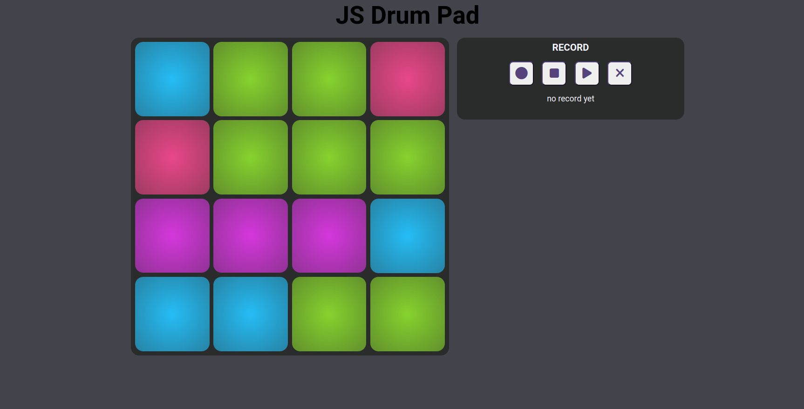
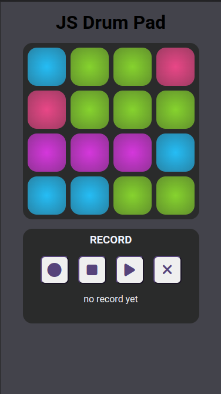

#Frontenders Community

## Challenge #5 - Drum Pad

In questa challenge l'obiettivo è creare un drum pad che riproduce un suono diverso della batteria al click su ogni tasto. In più, l'utente può registrare una sequenza di suoni cliccando sul pulsante Registra, cliccando sui suoni in sequenza e interrompendo la registrazione. Una volta registrata, può riprodurla.
N.B. non si tratta di una registrazione audio, ma solo di una sequenza di suoni in loop.
Ogni suono ha una sua tipologia, quindi possiamo colorare i tasti in base a quest'ultima per rendere l'app più bella.
Il layout è semplice, ma deve essere realizzato come una web app (a tutto schermo, quindi) e inoltre deve essere responsive.

### Starter Kit

Nello starter kit troverte una cartella assets, suddivisa in questo modo:

- **sounds**: contiene i suoni da riprodurre al click dei tasti (credits: https://plays.org/virtu-drum-pads/)
- **data.js**: un array js che contiene i dati dei suoni e delle altre informazioni utili allo sviluppo

### Consigli

Parti con una struttura a blocchi che definisca il layout (hint: flex o grid qui possono salvare diverse ore di lavoro). Una volta completato il layout inizia a ragionare sulle diverse funzionalità. Ad es. parti con la gestione del click sui tasti del drum pad, poi colori i pulsanti, poi provi a riprodurre gli audio, e così via.

**Font**: Roboto

### Bonus

- Prova a creare il layout responsive senza utilizzare le media query
- Dai all'utente la possibilità di scegliere la velocità di riproduzione della sequenza dei suoni

### Tecnologie

HTML, CSS/SASS.
JS plain o React / Vue / Svelte.
No librerie CSS.

### Preview

